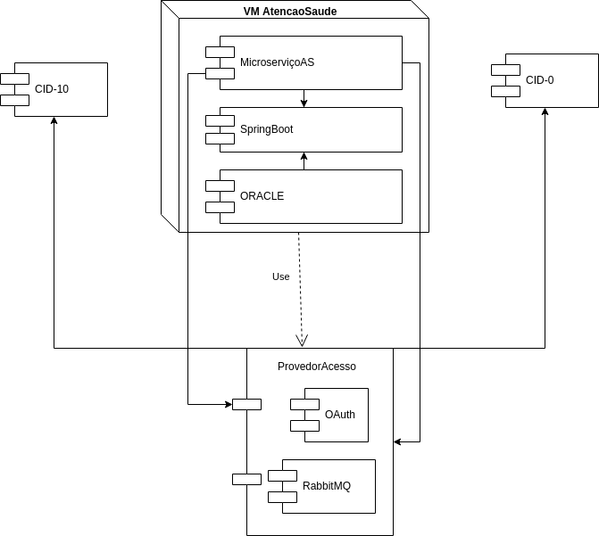
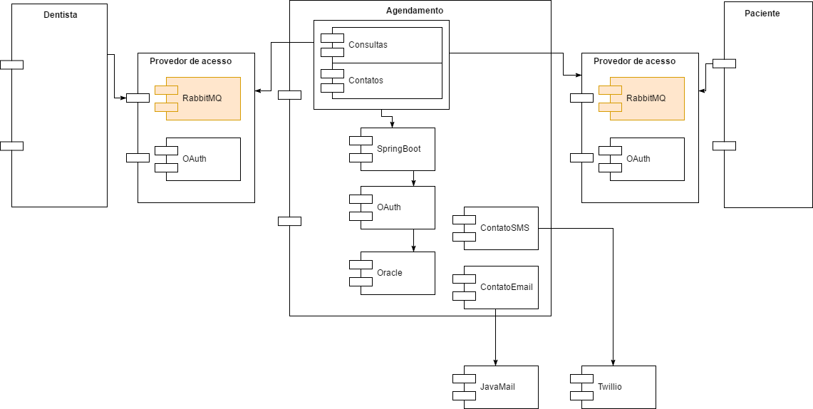

### Diagrama de Componentes | Especificação Atenção a Saúde

O diagrama de componentes acima explica que em uma máquina virtual estarão rodando os componentes referentes ao microserviço de atenção a saúde, o SGBD do banco de dados Oracle e o componente do springBoot que faz o acesso contínuo dos dados no componente ORACLE.

De acordo com os requisitos funcionais, faz-se necessário a comunicação com serviço externo, os quais são representados pelos componentes de CID-10 e CID-0, que estão o tempo todo escutando requisições.

O componente RabbitMQ é um servidor ativo para trocar de mensagem em sistemas, de tal forma que exista um produtor da mensagem e um receptor e vice-versa. Já o OAuth, servirá como um interceptador e validador das mensagens enviadas de todos os lados, promovendo assim a segurança dos dados que são trafegados pelo microserviços, juntamente com o OAuth que fará a verificação de usuário que requisita dados e se os parâmetros enviados são os esperados. Caso não seja parâmetro esperado, o OAuth apenas retornará para o fluxo de execução inicial e ficará pronto para validar as próximas requisições.

### Diagrama de Componentes | Especificação Agendamento

O diagrama de componentes acima explica que em uma máquina genérica estarão rodando os componentes referentes ao microsserviço de agendamento, o SGBD do banco de dados Oracle e o componente SpringBoot, que oferece assistência para acesso contínuo dos dados no componente Oracle.

Os componentes referentes ao microsserviço de Agendamento especificados acima estão divididos por responsabilidade, sendo o componente Consultas (referente a quaisquer funcionalidades referentes a Agendamento de consultas, visualização de consultas, entre outros), Contatos (referente a quaisquer funcionalidades referentes a visualização de agenda de contatos, entre outros), ContatoSMS e ContatoEmail (fazem, respectivamente o papel de repasse de mensagens para os serviços externos de JavaMail, para envio de emails, e Twilio, para envio de mensagens SMS) e o grupo de componentes para comunicação com o banco de dados: SpringBoot (implementação de requisições), OAuth (Encriptação de dados) e Oracle (SGBD). Para comunicação entre microsserviços é usado um provedor de acesso, que implementa OAuth e fornece servidor RabbitMQ (Transmissor de mensagens de um microsserviço para outro).

### Diagrama de Componentes | Especificação Financeiro e Faturamento

### Diagrama de Componentes | Especificação Paciente

