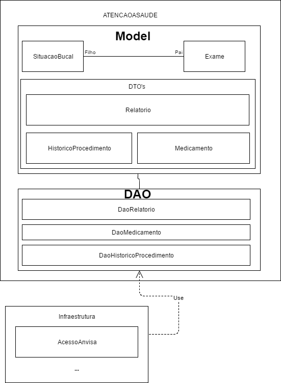
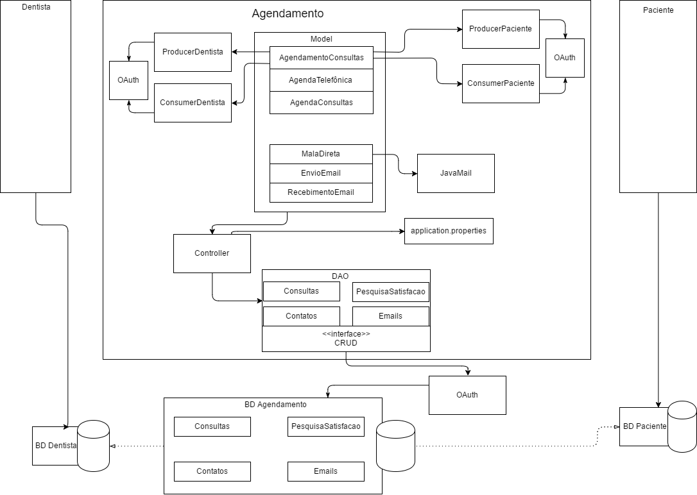
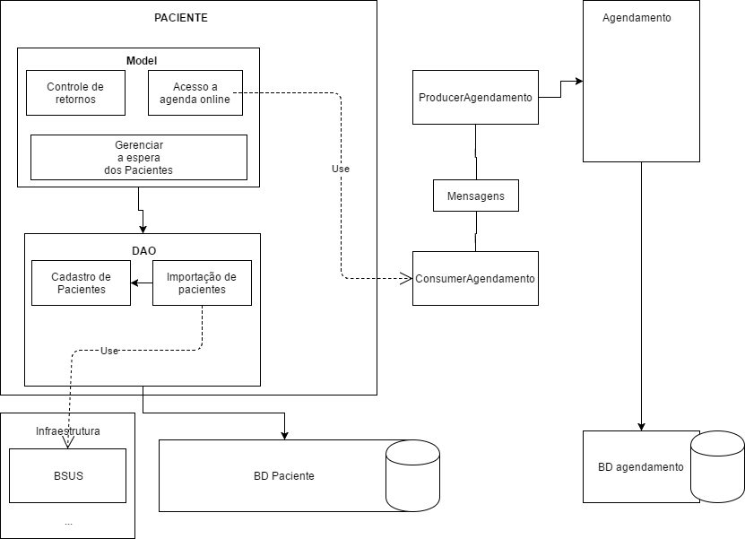
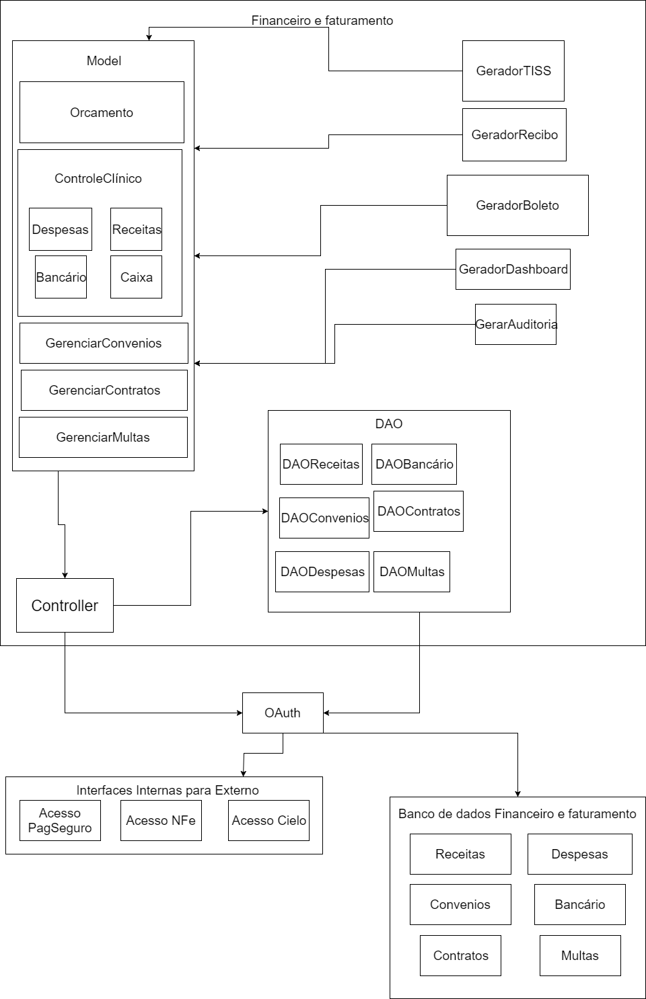

O diagrama acima trata-se de uma arquitetura orientada a microserviços, de tal forma que cada microserviço tenha sua responsabilidade em disponibilizar os dados, atendendo os requisitos de qualidade.

## Cliente
O módulo cliente engloba as camadas fábrica, UI Views (User Interface), models e controllers.
A parte de fábrica funciona de forma genérica, atuando do redirecionamento de aplicações de acordo com a funcionalidade exigida pelo usuário. Um exemplo disso, seria a parte de agendamento, o qual é reponspavel por realizar o agendamento das consultas, de tal forma que, ocorra a disponibilização de uma interface gráfica para a realização das seguintes operações:
- Cadastro de consulta
- Confirmação de consulta
- Notificação de data de retorno para pacientes.
- Consultar dados dos pacientes como endereço, email, whatsapp, skype, etc.

UI Views contém o front-end referente a parte de agendamento, paciente, atenção à saúde, Recursos Humanos, estoque e Financeiro e Faturamento.

Models contém a parte de regra de negócio das Views de serão geradas pela fábrica genérica, ou seja, em models haverá toda a estrutura de atributos de acordo com a view específica.

Controllers contém os métodos responsáveis tanto por delegar ações (Actions), para classes controladoras posteriores, quanto por realizar requisições http de acordo com os dados inseridos nos formulários das views que estão em UI Views.

## API Gateway

De acordo com definições da Amazon API Gateway, podemos entender que é um serviço que permite o desenvolver criar, monitorar e manter a API em qualquer escala, funcionando como uma porta de conexão de acesso à dados externos.

Fonte: https://aws.amazon.com/pt/api-gateway/ Acesso em 26 de Jun. 2017. 

### Atenção à Saúde

- Em atenção a saúde foi separado dois módulos, um que é o model que conterá as entidades de negócio e o DAO, que fica responsável por realizar o acesso aos dados. DAO (Data Acces Object), padrão utilizado para abstrair e encapsular todo os acessos ao data source. Fonte:
http://www.devmedia.com.br/implementando-o-data-access-object-no-java-ee/33339 . Acesso em 27 de Jun. 2017.

A entidade Exame, conterá os atributos referente ao exame do paciente, todas as informações pertinente a exame, tais como um conjunto de classes estão nesse módulo. Dessa forma, temos que situaçãoBucal possui uma associação simples com exame, isso é devido ao fato dessa classe utilizar algumas informações do exame para realizar a construção do objeto que contém informações da situação do paciente.
Assim sendo, faz-se necessário o uso de um módulo que contém os DTO's dos seguintes objetos: Relatorio, HistoricoProcedimento e Medicamento. DTO (Data transfer Object), padrão de projeto que utiliza objetos de entidades de negócio para transferir dados entre subsistemas de um software. Fonte: https://msdn.microsoft.com/en-us/library/ms978717.aspx . Acesso em 26 de Jun. 2017.

- Relatórios : Atendendo ao requisito em que diz que é necessário um relatório de procedientos realizados. Com este padrão de projeto, pode-se fazer transferência de dados de um relatório gerado a partir de um procedimento odontológico ocorrido.
- Historico de Procedimento: Faz-se necessário o uso de um DTO para trafegar informações das mudanças ocorridas em um procedimento odontológico, tais como se o procedimento foi aberto, cancelado ou realizado.
- Medicamento: Este módulo possui um conjunto de classes referente ao medicamento prescrito pelo corpo clínico. No entanto, este módulo depende de cadastro prévio a partir de bases como ANVISA. Dessa forma, o uso de DTO para medicamento torna fácil o envio e acesso de dados da parte de medicamentos

## Data Acces Object | Atenção a Saúde

O módulo DAO fica responsável por realizar a obtenção dos dados para medicamentos, relatórios e histórico de procedimentos. São um conjunto de interfaces com metódos de busca, inserção e atualização que são implementados por classes posteriores que podem fazer acesso via API Rest utilizando Spring Restful, ou mesmo Spring Cloud realizando as requisições Http necessárias para o microserviço de atenção à saude.

O módulo infraestrutura que contém "AcessoAnvisa" é apenas uma projeção do módulo de infraestrutura especificado no primeiro diagrama, isso quer dizer que o DaoMedicamento usa um módulo que está em infraestrutura para acessar os dados referente ao medicamento prescrito pelo corpo clínico.

## Agendamento

Descrição:

## Paciente

Descrição:

## Financeiro e Faturamento 

Descrição:
