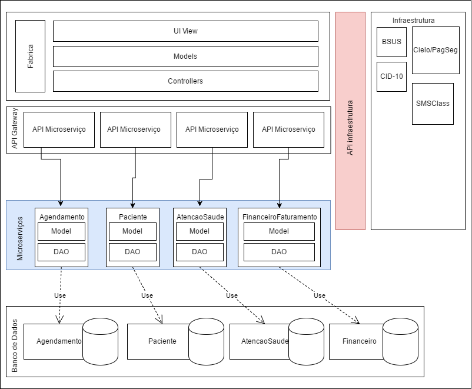

O diagrama mostrado anteriormente é um diagrama de módulo alto nível, ou seja, serve apenas para exemplificar
o relacionamento entre os módulos, de tal forma que evidencie o uso de funcionalidades um do outro.

### Relacionamentos | Agendamento e Paciente
	Um relacionamento notório é o módulo de agendamento de consultas, que por sua vez, faz o uso do módulo de paciente.
	Na parte de agendamento, existe um requisito funcional que trata do controle de retornos, o qual fica responsável por
	fornecer um data para que o paciente retorne para uma consulta. Além disso, paciente também fica responsável ou disponibiliza
	tal funcionalidade
## Atenção a saúde e paciente
Outro exemplo de relacionamento e modulos utilizando funcionalidades entre si, é o módulo de atenção a saúde que agrega informações em paciente, principalmente na funcionalidade responsável
por se tratar da situação bucal, prescrição médica e atestado do paciente.
